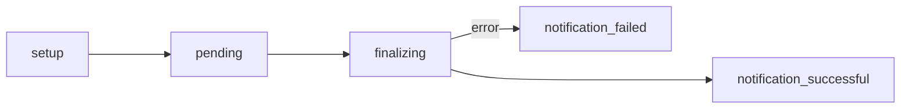
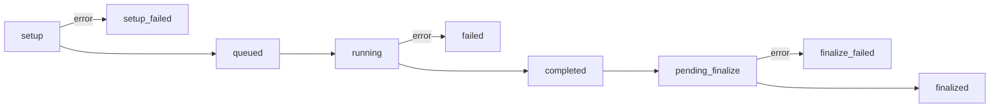

# Bulk Site Creator

The Bulk Site Creator tool allows administrators to select batches of courses in a particular term and create Canvas course sites for them, optionally applying a template.

Site creation batches are processed by a background job that currently runs on the EC2 cronserver. Each batch goes through a series of workflow stages, and each site-creation task within the batch goes through a separate series of workflow stages.

Each batch is recorded in the `bulk_canvas_course_crtn_job` table, and each site-creation task is recorded in the `canvas_course_generation_job` table.

## Batch workflow steps

## Task workflow steps

